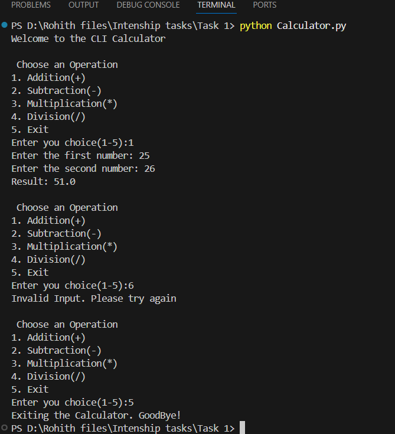

# CLI Calculator App - Internship Task

# Task Objective 
Create a command-line calculator supporting basic arithmatic Operations.

# Features
1. Addition(+)
2. Subtraction(-)
3. Multiplication(*)
4. Division(/) (with divide by zero check)
5. Input validation 
6. Looping until user exits

# Technologies used 
python 3
Vs code (for writing code)
Terminal (for running the script)

# How to Run 

1. clone or download this repository.
2. Open the terminal in the project directory.
3. Run the following command:

" bash "
python Calculator.py

4. Follow the menu and input instructions.

# Sample Output
